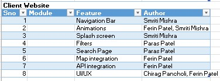

# RentMe

RentMe is a website that provides available rental apartments from a variety of
real estate websites, including Kijiji, Killam, and Capreit. We've come up with
a way to help people find the best deal in the market. Customers have a unique
view of the housing market as a whole since we make it simple for them to
communicate with their landlords. The user, the administrator, and the landlord
are the three main actors in this program. Users will be able to get the best
deal. RentMe will allow the landlord to market a rental property. RentMe will
make it easier for the user to connect with the landlord. Both the user and the
landlord will be managed by the administrator.

In this documentation we will talk about:

> 1.  Dependencies
> 
> 2.  Build documentation
> 
> 3.  User Scenarios
> 
> 4.  Small Analysis Summary
> 
> 5.  Member Contribution Files
> 
> 6.  Technologies used

### Dependencies:

**RentMe has the following dependencies:**

> 1.  **For Admin: Please read the README file from** *group3/admin* **for the
>     detailed instructions.**
> 
> ~~~~~~~~~~~~~~~~~~~~~~~~~~~~~~~~~~~~~~~~~~~~~~~~~~~~~~~~~~~~~~~~~~~~~~~~~~~~~~~~
>     "@date-io/core": "1.3.13",
> 
>     "@date-io/date-fns": "1.3.13",
> 
>     "@date-io/moment": "1.3.13",
> 
>     "@fullcalendar/core": "5.7.0",
> 
>     "@fullcalendar/daygrid": "5.7.0",
> 
>     "@fullcalendar/interaction": "5.7.0",
> 
>     "@fullcalendar/react": "5.7.0",
> 
>     "@fullcalendar/timegrid": "5.7.0",
> 
>     "@hookform/resolvers": "2.5.1",
> 
>     "@material-ui/core": "4.11.4",
> 
>     "@material-ui/data-grid": "4.0.0-alpha.22",
> 
>     "@material-ui/icons": "4.11.2",
> 
>     "@material-ui/lab": "4.0.0-alpha.58",
> 
>     "@material-ui/pickers": "3.3.10",
> 
>     "@reduxjs/toolkit": "1.5.1",
> 
>     "apexcharts": "3.26.3",
> 
>     "auth0-lock": "11.30.0",
> 
>     "autosuggest-highlight": "3.1.1",
> 
>     "axios": "0.21.1",
> 
>     "axios-mock-adapter": "1.19.0",
> 
>     "bootstrap": "4.5.0",
> 
>     "chart.js": "2.9.4",
> 
>     "clsx": "1.1.1",
> 
>     "cross-fetch": "3.1.4",
> 
>     "date-fns": "2.21.3",
> 
>     "draft-js": "0.11.7",
> 
>     "draftjs-to-html": "0.9.1",
> 
>     "firebase": "8.6.2",
> 
>     "formsy-react": "2.2.5",
> 
>     "framer-motion": "4.1.17",
> 
>     "google-map-react": "2.1.9",
> 
>     "history": "4.10.1",
> 
>     "i18next": "20.3.0",
> 
>     "jsonwebtoken": "8.5.1",
> 
>     "jss": "10.6.0",
> 
>     "jss-plugin-extend": "10.6.0",
> 
>     "jss-rtl": "0.3.0",
> 
>     "jwt-decode": "2.2.0",
> 
>     "keycode": "2.2.0",
> 
>     "lodash": "4.17.21",
> 
>     "marked": "0.8.2",
> 
>     "material-ui-popup-state": "1.8.3",
> 
>     "mobile-detect": "1.4.5",
> 
>     "moment": "2.29.1",
> 
>     "notistack": "1.0.9",
> 
>     "path-to-regexp": "3.2.0",
> 
>     "perfect-scrollbar": "1.5.1",
> 
>     "prismjs": "1.23.0",
> 
>     "prop-types": "15.7.2",
> 
>     "qs": "6.10.1",
> 
>     "raw-loader": "4.0.2",
> 
>     "react": "17.0.2",
> 
>     "react-apexcharts": "1.3.9",
> 
>     "react-autosuggest": "10.1.0",
> 
>     "react-beautiful-dnd": "13.1.0",
> 
>     "react-chartjs-2": "2.11.2",
> 
>     "react-csv-importer": "\^0.5.0",
> 
>     "react-dom": "17.0.2",
> 
>     "react-draft-wysiwyg": "1.14.7",
> 
>     "react-draggable": "4.4.3",
> 
>     "react-frame-component": "4.1.3",
> 
>     "react-hook-form": "7.7.1",
> 
>     "react-i18next": "11.9.0",
> 
>     "react-masonry-css": "1.0.16",
> 
>     "react-number-format": "4.5.5",
> 
>     "react-popper": "1.3.11",
> 
>     "react-redux": "7.2.4",
> 
>     "react-router": "5.2.0",
> 
>     "react-router-config": "5.1.1",
> 
>     "react-router-dom": "5.2.0",
> 
>     "react-rrule-generator": "\^1.2.0",
> 
>     "react-scripts": "4.0.3",
> 
>     "react-select": "3.2.0",
> 
>     "react-spring": "9.1.2",
> 
>     "react-swipeable": "6.1.2",
> 
>     "react-swipeable-views": "0.13.9",
> 
>     "react-swipeable-views-utils": "0.13.9",
> 
>     "react-table": "7.7.0",
> 
>     "react-text-mask": "5.4.3",
> 
>     "react-toastify": "\^7.0.4",
> 
>     "react-virtualized": "9.22.3",
> 
>     "react-window": "1.8.6",
> 
>     "redux": "4.1.0",
> 
>     "redux-logger": "4.0.0",
> 
>     "styled-components": "5.3.0",
> 
>     "typeface-poppins": "1.1.13",
> 
>     "velocity-animate": "1.5.2",
> 
>     "velocity-react": "1.4.3",
> 
>     "web-vitals": "\^0.2.4",
> 
>     "yup": "0.32.9"
> ~~~~~~~~~~~~~~~~~~~~~~~~~~~~~~~~~~~~~~~~~~~~~~~~~~~~~~~~~~~~~~~~~~~~~~~~~~~~~~~~
> 
> 2.  **For Server: Please read the README file from** *group3/server* **for the
>     detailed instructions.**
> 
> ~~~~~~~~~~~~~~~~~~~~~~~~~~~~~~~~~~~~~~~~~~~~~~~~~~~~~~~~~~~~~~~~~~~~~~~~~~~~~~~~
>     "@nestjs/common": "\^8.0.0",
> 
>     "@nestjs/core": "\^8.0.0",
> 
>     "@nestjs/platform-express": "\^8.0.0",
> 
>     "@nestjs/schedule": "\^1.0.2",
> 
>     "@nestjs/swagger": "\^5.2.0",
> 
>     "@nestjs/typeorm": "\^8.0.3",
> 
>     "@sendgrid/mail": "\^7.6.2",
> 
>     "bcryptjs": "\^2.4.3",
> 
>     "class-transformer": "\^0.5.1",
> 
>     "class-validator": "\^0.13.2",
> 
>     "cloudinary": "\^1.29.0",
> 
>     "jsonwebtoken": "\^8.5.1",
> 
>     "node-geocoder": "\^4.0.0",
> 
>     "pg": "\^8.7.3",
> 
>     "puppeteer": "\^13.4.0",
> 
>     "puppeteer-core": "\^13.4.0",
> 
>     "query-string": "\^7.1.1",
> 
>     "reflect-metadata": "\^0.1.13",
> 
>     "rimraf": "\^3.0.2",
> 
>     "rxjs": "\^7.2.0",
> 
>     "swagger-ui-express": "\^4.3.0",
> 
>     "typeorm": "\^0.2.41",
> 
>     "typeorm-pagination": "\^2.0.3"
> ~~~~~~~~~~~~~~~~~~~~~~~~~~~~~~~~~~~~~~~~~~~~~~~~~~~~~~~~~~~~~~~~~~~~~~~~~~~~~~~~
> 
> 3.  **For Web:** **Please read the README file from** *group3/web* **for the
>     detailed instructions.**
> 
> ~~~~~~~~~~~~~~~~~~~~~~~~~~~~~~~~~~~~~~~~~~~~~~~~~~~~~~~~~~~~~~~~~~~~~~~~~~~~~~~~
>     "@chakra-ui/react": "\^1.7.4",
> 
>     "@emotion/react": "11",
> 
>     "@emotion/styled": "11",
> 
>     "@react-google-maps/api": "\^2.7.0",
> 
>     "@testing-library/jest-dom": "\^5.16.1",
> 
>     "@testing-library/react": "\^12.1.2",
> 
>     "@testing-library/user-event": "\^13.5.0",
> 
>     "@types/jest": "\^27.4.0",
> 
>     "@types/node": "\^16.11.21",
> 
>     "@types/react": "\^17.0.38",
> 
>     "@types/react-dom": "\^17.0.11",
> 
>     "axios": "\^0.26.0",
> 
>     "framer-motion": "5",
> 
>     "react": "\^17.0.2",
> 
>     "react-dom": "\^17.0.2",
> 
>     "react-google-autocomplete": "\^2.6.1",
> 
>     "react-icons": "\^4.3.1",
> 
>     "react-responsive-carousel": "\^3.2.22",
> 
>     "react-router-dom": "\^6.2.1",
> 
>     "react-scripts": "5.0.0",
> 
>     "react-toastify": "\^8.1.0",
> 
>     "typescript": "\^4.5.5",
> 
>     "web-vitals": "\^2.1.4"
> ~~~~~~~~~~~~~~~~~~~~~~~~~~~~~~~~~~~~~~~~~~~~~~~~~~~~~~~~~~~~~~~~~~~~~~~~~~~~~~~~

                                        Fig: Application Overview

### Build documentation:

**The project structure:**

~~~~~~~~~~~~~~~~~~~~~~~~~~~~~~~~~~~~~~~~~~~~~~~~~~~~~~~~~~~~~~~~~~~~~~~~~~~~~~~~
.

├── admin

├── server

├── web

├──. gitlab-ci.yml

├── netlify.toml

└── README.md
~~~~~~~~~~~~~~~~~~~~~~~~~~~~~~~~~~~~~~~~~~~~~~~~~~~~~~~~~~~~~~~~~~~~~~~~~~~~~~~~

### Admin: ReactJs and the open-source react theme Fuse was used to create the admin.

### Server: NestJs was used to create the server. For our project, we're utilizing TypeORM as an ORM tool.

### Web: The web folder contains the entire client-facing website built using ReactJs.

## Setup:

> 1.  NodeJs
> 
>     1.  you can install nodejs on your computer using <https://nodejs.org/en/>
> 
> 2.  npm or yarn

### User Scenarios:

> >

                                                    Fig: UseCase Diagram

1.  Title: Create an account for the tenant

    Actor: Tenant

    Scenario: If the user is interested to use this website, they must create an
    account. For creating an account all you need to give is your name and valid
    email address and password.

    

                                                         Fig: SignUp Page

2.  Title: Log in as the tenant

    Actor: Tenant

    Scenario: If the user has an account on our website, they can log in. For
    logging in you need to enter an email address and password.

    

                                                            Fig: LogIn Page

3.  Title: Search for a rental unit

    Actor: Tenant

    Scenario: For searching any rental unit, a tenant can specify the location
    and search for the available options.

    

                                                            Fig: Search Panel

    

                                                            Fig: Search Result

4.  Title: Add filters (Property/Room/Price/Radius)

    Actor: Tenant

    Scenario: For searching for a rental unit, the tenant can set some filters
    for the best and optimal result. Filters available are property type (house,
    apartment, condo and studio), number of rooms (1BHK, 2BHK, 3BHK and 3+BHK),
    price range (0 - \$500, \$500 - \$1000, \$1000-\$2000 and \$2000+) and
    finally targeted radius (0-2KM, 2KM - 5KM, 5KM - 10KM and 10KM+).

    

                                                        Fig: Properties Filter

                                                        Fig: Room Filter

                                                        Fig: Price Filter

                                                        Fig: Radius Filter

5.  Title: Get Google Map visualization

    Actor: Tenant

    Scenario: The search result can be visualized on the google map which is
    integrated into the website. For detailed view redirection to Google Maps is
    also available.

    

                                                    Fig: Google Map Visualization

6.  Title: Redirect to the respective website

    Actor: Tenant

    Scenario: Once the property is viewed by the tenant, to see the original
    post they can directly redirect themselves to the respective website in
    order to see the original post.

    

                                                Fig: Detailed property page

    

                                                Fig: Redirected to the respective website

7.  Title: Log in as the admin/landlord

    Actor: Admin/Landlord

    Scenario: For logging in you need to enter an email address and password.

    

                                                Fig: Admin panel launching portal

    

                                                 Fig: Log-in Page

    

                                                 Fig: Admin Panel

8.  Title: Create an account for the landlord

    Actor: Landlord

    Scenario: If the landlord is interested to use this website for uploading
    the properties then they must create an account. For creating an account all
    you need to give is your name and valid email address and password.

    

                                                Fig: SignUp For Landlord

9.  Title: Personalize layout change of the page

    Actor: Landlord/Admin

    Scenario: To change the layout of the page, they can do it by selecting
    various layout options we have.

    

                                                Fig: Theme Settings

10.  Title: Personalize change of background color of the page

    Actor: Admin

    Scenario: To change the color of the page, they can do it by selecting
    various color palettes available.

                                            Fig: Theme color schemes

11.  Title: Personalize change of the font size

    Actor: Admin

    Scenario: To change the size of the font of the page, they can do it by
    increasing or decreasing the font size from the option available on the top
    of the window.

> >

                                                Fig: Font Size

12.  Title: Personalize change language (English/ Arabic/Turkish)

    Actor: Admin

    Scenario: To change the language of the page, they can do it by either
    selecting English or Arabic, or Turkish.

                                                Fig: Language Choice

13.  Title: Add properties information

    Actor: Landlord

    Scenario: To add your property to this application you can add a property
    with basic information like title/price/bedroom/size and optional URL if
    any, in the admin panel, add the address and add the image of the property.

 
                                                Fig: Adding New Properties

### Smell Analysis Summary:

    We have used SonarQube an open-source platform created by SonarSource for
    continuous code quality inspection and static code analysis to detect bugs
    and code smells. We're utilizing the sonarqube's own cloud-based sonar
    runner. We're running a sonar scanner on our GitLab pipeline which sends the
    report to the sonar cloud after each commit in the main branch.

                                                 Fig: SonarQube Result

### Member Contribution file:

### CI/CD Pipeline:

### TECHNOLOGIES USED:**

> 1.  NodeJs
> 
>     
> 
> 2.  NestJs
> 
>     
> 
> 3.  React
> 
>     
> 
> 4.  Heroku
> 
>     
> 
> 5.  PostgreSQL
> 
>     

